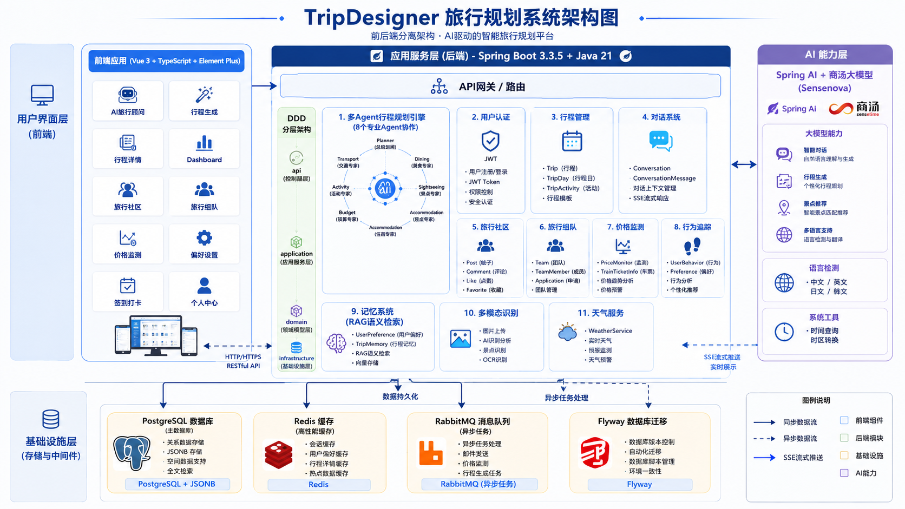

# Trip Designer

> **AI 旅行设计师 —— Design Experience, Not Search Information.**

一个基于 AI 多智能体协作的旅行规划系统，通过大语言模型（LLM）和多 Agent 工作流，自动为用户生成个性化旅行计划。

***

## 目录

- [项目概述](#项目概述)
- [技术栈](#技术栈)
- [技术架构](#技术架构)
- [模块说明](#模块说明)
- [快速开始](#快速开始)
- [详细文档](#详细文档)

***

## 项目概述

Trip Designer 是一款 AI 驱动的旅行规划工具，核心能力包括：

| 功能               | 说明                                                                        |
| ---------------- | ------------------------------------------------------------------------- |
| 🧠 **AI 多智能体协作** | 8 个专业 Agent 协同工作，涵盖规划、交通、餐饮、景点、住宿、预算、活动、复盘                                |
| ⚡ **并行执行**       | Transport/Dining/Sightseeing/Accommodation/Budget 5 个 Agent 并行执行，性能提升 80% |
| 📝 **智能行程生成**    | 用户输入自然语言需求，AI 自动生成完整行程（含每日活动和预算分配）                                        |
| 🔍 **RAG 语义检索**  | 使用 PostgreSQL pgvector 实现用户记忆和目的地知识的向量化存储与语义检索                            |
| 💬 **对话式优化**     | 通过与 AI 多轮对话不断优化和完善行程                                                      |
| 📋 **行程管理**      | 完整 CRUD + 分页查询 + 关键词搜索                                                    |
| 🧠 **偏好记忆**      | AI 自动学习用户偏好，用于后续个性化推荐                                                     |
| 🏘️ **旅行社区**     | 帖子发布与评论系统，支持点赞/收藏                                                         |
| 👥 **旅行组队**      | 队伍创建与申请流程，目的地匹配推荐                                                         |
| 💰 **智能价格监测**    | 监测航班/酒店/火车价格变化，定时触发提醒                                                     |
| 💬 **AI 旅行顾问**   | 基于 RAG 的旅行顾问对话，支持流式输出                                                     |
| 🎨 **多模态行程生成**   | 图片上传识别目的地，AI 自动生成相关行程                                                     |

***

## 技术栈

### 后端

| 技术              | 版本     | 用途                     |
| --------------- | ------ | ---------------------- |
| Java            | 21     | 主语言                    |
| Spring Boot     | 3.3.5  | Web 框架                 |
| Spring AI       | 1.0.0  | AI/LLM 集成              |
| Spring Security | 6.x    | 认证授权                   |
| MyBatis Plus    | 3.5.9  | ORM 框架                 |
| PostgreSQL      | 16     | 主数据库（JSONB + pgvector） |
| Redis           | 7.x    | 缓存、令牌存储、限流             |
| Flyway          | 10.x   | 数据库迁移                  |
| JJWT            | 0.12.6 | JWT 令牌                 |
| Lombok          | 1.18+  | 简化代码                   |

### 前端

| 技术           | 版本  | 用途       |
| ------------ | --- | -------- |
| Vue 3        | 3.x | 前端框架     |
| TypeScript   | 5.x | 类型安全     |
| Vite         | 6.x | 构建工具     |
| Element Plus | 2.x | UI 组件库   |
| Pinia        | 2.x | 状态管理     |
| Vue Router   | 4.x | 路由管理     |
| Axios        | 1.x | HTTP 客户端 |

***

## 技术架构

### 整体架构



### 分层架构（DDD）

项目严格遵循领域驱动设计（Domain-Driven Design）的四层架构：

```
┌───────────────────────────────────────────────┐
│                 API 层（Controller）              │
│  职责：HTTP 请求/响应处理、参数校验、结果封装       │
├───────────────────────────────────────────────┤
│            Application 层（Service）             │
│  职责：用例编排、事务管理、调用领域对象             │
├───────────────────────────────────────────────┤
│             Domain 层（核心）                    │
│  职责：核心业务逻辑、领域实体、值对象、仓储接口     │
├───────────────────────────────────────────────┤
│          Infrastructure 层（Repository Impl）    │
│  职责：持久化实现、缓存、安全、外部服务             │
└───────────────────────────────────────────────┘
```

### 包结构

```
com.tripdesigner/
├── TripDesignerApplication.java     # Spring Boot 启动类
├── ai/                              # AI 模块
│   ├── api/                         # AI API 控制器
│   ├── config/                      # Spring AI 配置
│   ├── rag/                         # RAG 语义检索
│   ├── tool/                        # AI 工具函数
│   └── trip/                        # 行程规划引擎
│       ├── agent/                   # 8 个专业 Agent
│       └── workflow/                # 工作流管理
├── auth/                            # 认证模块
├── conversation/                    # 对话模块
├── experience/                      # 体验分享模块
├── memory/                          # 记忆偏好模块
├── trip/                            # 行程核心模块
├── user/                            # 用户模块
├── community/                       # 旅行社区模块
├── team/                            # 旅行组队模块
├── price/                           # 价格监测模块
├── multimodal/                      # 多模态模块
└── common/                          # 公共基础设施
```

***

## 模块说明

| 模块               | 说明                                          |
| ---------------- | ------------------------------------------- |
| **auth**         | JWT + Refresh Token 双令牌认证，Redis 存储刷新令牌      |
| **trip**         | 行程核心模块，Trip → TripDay → TripActivity 三层数据结构 |
| **conversation** | AI 对话管理，支持多轮对话和消息记录                         |
| **ai**           | 项目核心亮点，8 个专业 Agent 协作生成行程                   |
| **memory**       | 用户偏好和旅行记忆，支持 RAG 语义检索                       |
| **experience**   | 旅行体验分享，关联行程/日活动，支持评分和标签                     |
| **community**    | 旅行社区，帖子发布、评论、点赞、收藏                          |
| **team**         | 旅行组队，队伍创建、申请审核、目的地匹配                        |
| **price**        | 价格监测，航班/酒店/火车价格追踪和提醒                        |
| **multimodal**   | 多模态行程生成，图片上传识别目的地                           |

***

## 快速开始

### 前置条件

- Java 21+
- Docker & Docker Compose
- Node.js 20+

### 启动步骤

```bash
# 1. 克隆项目
git clone <repo-url> && cd TripDesigner

# 2. 配置环境变量
cp .env.example .env
# 编辑 .env，填入 AI_API_KEY

# 3. 启动中间件（PostgreSQL + Redis）
docker compose up -d postgres redis

# 4. 启动后端（Flyway 自动执行数据库迁移）
./mvnw spring-boot:run

# 5. 启动前端
cd frontend
npm install
npm run dev
# 访问 http://localhost:3000
```

***

## 详细文档

| 文档     | 路径                                         | 说明                       |
| ------ | ------------------------------------------ | ------------------------ |
| API 文档 | [docs/api.md](docs/api.md)                 | 完整的 RESTful API 接口列表     |
| 数据库设计  | [docs/database.md](docs/database.md)       | 表结构、字段说明、设计决策            |
| AI 工作流 | [docs/workflow.md](docs/workflow.md)       | 多智能体工作流设计、Agent 职责、个性化机制 |
| 开发指南   | [docs/development.md](docs/development.md) | 开发规范、命名约定、测试、部署          |
| 架构图    | [docs/架构图.png](docs/架构图.png)               | 系统架构可视化图                 |

***

